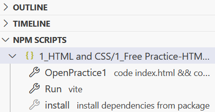

# Intro to Your Environment for 123 Students
Hello! Welcome to CSC 123! Here is a quick introduction for this assignment and the environment. 

This file is called a README. It is the first item that you should look at when you start a pre-built project or assignment. In this context, it contains an overview of your programming environment and how to get started.

On your left, there is a section of the codespace called the "Explorer". Use this to navigate the files in your assignment. Don't worry, a lot of those files you won't even have to worry
about. Just follow these instructions and you'll be set up quick and easy!

# Environment Setup

To work on this project, there are quick setups to handle. Click on the file called "package.json".
You don't have to do anything with this file, it just needs to be opened. After you open the file,
feel free to close it. (Make sure that you haven't made any changes!)

After opening and closing the file, you should see a a new menu at the bottom of your explorer labeled "NPM Scripts". 
(If that menu doesnt pop up, click the 3 dots at the top of the Explorer to open up the features menu. Scroll down and click "NPM Scripts", and the script button menu will pop up!) These are the "Quick Buttons" you will use to for setting up and running your assignments. Pretty easy, right?

# .devcontainer Information
The devcontainer is limited. It is only being used to download the necessary VSCode extensions for this project, which include: 
1. Liveshare (Used for sharing access to a Codespace for group project work)

# package.json Information
Each assignment has it's own package.json file associated with it. Here are the unique scripts (Quick Buttons) associated with each package.json for this assignment.

# Quick Buttons
* Lab 2 Part 1-HTML and CSS
    * OpenLab2.1: Opens the neccesary files for this assignment. Feel free to close and open files at your leisure.
    * Run: Runs the program for this assigment. When pressed, a popup will appear on the bottom right to open up a browser window. Click "Open in browser" and see your assignment in action! If this script button is pressed again, you can terminate the browser window from the same popup in the bottom right with "Terminate Task".
    * Install: Reinstalls the necessary dependencies if there are issues with the program. If you are having trouble, click this and run your program again before trying other methods.

# Setup for Group Assignments
For group assignments, Liveshare is an extension tool that will be used to work together on projects at the same time. It can be a little complicated, so here is a quick tutorial to get you all set up!

First off, make sure that you all have a way to message each other on your laptops (whether by email, discord, or another chat program). This is so that you can send the join link to one another.

Then, select one project member to be the group leader. This is because one person will need to create the shared programming space, and then everyone else can join! (Heads up, I will refer to the project leader as the "leader" and the other group members as "other members" so it's easy to differentiate.)

Now, the leader opens a Codespace that you intend to work on together. Then, they will select the Live Share icon from the bottom of their screen. It looks like this:

Two popups will appear:

Click the X on both, you do not need to do anything with them.

Now, the link to this shared project will be copied. Simply open whatever chat program you are using to message to your teammates and paste the link and send to them. Now they can access the shared project! :)

* Tip: If you somehow copied another item before you shared it to your teammates, you can still copy the link! There is a menu on the left side in the "Explorer" called "Live Share". Expand this menu and press "Copy Collaboration Link", as shown below:

Now the leader should wait for the other members to join.

The next steps are to get the other members access to the project. They will start by clicking the link sent to them by the leader. The link will open up in a browser, and start with a page that looks like this:

Click "Continue in web". A popup will come up on the bottom right.

In this popup, click sign in so that you can sign in with your Github account. Then, another popup will open that allows you to sign in to either Github or Microsoft. Here is what it looks like:

Now, click the Github option. A popup will appear for you to sign in. Sign in with your username and password, and then you can access the project under your github account!

Now, the leader and the other members can work together on the project. Check it out!

* Notes: When the other members first join, they will be following the leaders viewpoint. This means that the screens of the other members will show and follow the leaders cursor and pages. The other members can take control of their own screens by clicking on a file that the leader is not accessing. Then, the other members have free access to go and program as they wish.

# Features of LiveShare

There are a few useful features to bring to your attention about LiveShare.

The first will be a small menu in the top right of your codespace. The first button is the "follow participant" button. This allows you to select another group members cursor and page to follow and view. As they switch pages and type, your screen will view and follow. You can cancel this selection by clicking any other file that they are not on, and you will resume control of your screen. You can also select the same button, which will now be labeled as "unfollow participant", for the same effect.

The second feature of that same menu is the button to the immediate right of "follow participant". This is the "focus participant" button. This calls the other programmers to view your cursor and open pages. Be careful when using this feature, as it immediately calls them to view you, and you do not want to interrupt their flow of work. It is probably best to notify the other group members first, or just show them your screen in person.

Another section is another menu for Liveshare. Open this menu by clicking the "shared" button at the bottom of the Codespace.

This opens up a menu in the search part of the codespace. 

In this menu, you can copy the link to invite others, share your terminal, share a server (not relevent to this course), and end the liveshare session.

The other section to be wary of is the live share menu in bottom left in the "Explorer" section. This menu was already mentioned when showing how the group leader could send invites, but there are a few more features to be aware of. Here is the menu:

These features are mainly for the group leader, but other members can view this menu for information.

The first tab is the Participants tab. This shows the name of the other group members that are working on this project. The leader can remove these members from this menu, or add more members.

The second tab is the Shared Terminals tab. The leader can share access to the command prompt. Be careful with this option, as it allows other members to have full control. Ideally, you will not be using the command prompt in this class, but perhaps it will be necessary. If you do not know what this is, ask your professor. They will probably give you a quick overview and tell you not to use it for now due to its complexity.

The next tab is Shared Servers, which will not be relevent.

The next tab is comments, which is not relevent either.

The final tab is Session Chat. Select this and you can send messages between project group members working in this codespace. This is ideal for quick conversation or for sending links.

* A few quirks to note: Other members are not able to access the NPM Scripts menu and use the Quick Buttons (which were discussed previously). While everyone can work on the project, the leader will have to run the program and view it on their screen to find out the final outcome. Unfortunate, but a quirk of liveshare.

# Extra notes
If your program is having trouble running, close the process and reopen. This menu on the bottom right will allow you to shut down running processes. Simply open it, click the trash can symbol, wait a few seconds, and then try to run your project again by clicking "Run".

In this image, it shows the running processes menu on the right. Simply click that trash can symbol and it will end.

The menu could also look like this. The trash can in this setup is in the top right of this image:

Good luck with your assignments, and happy programming! :)