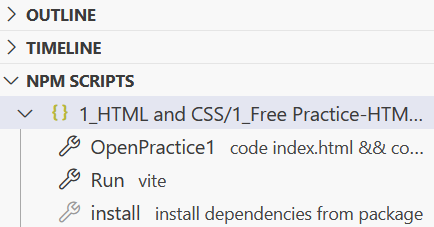
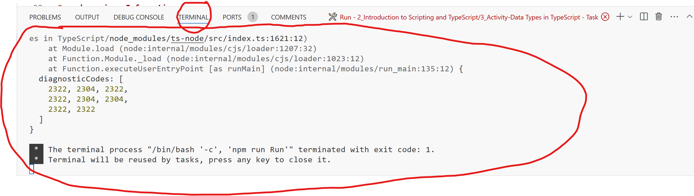
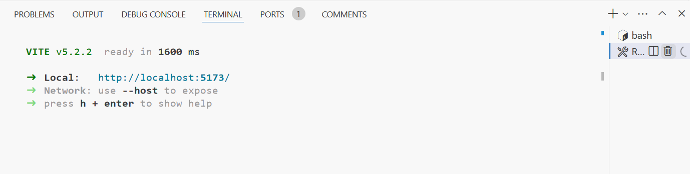
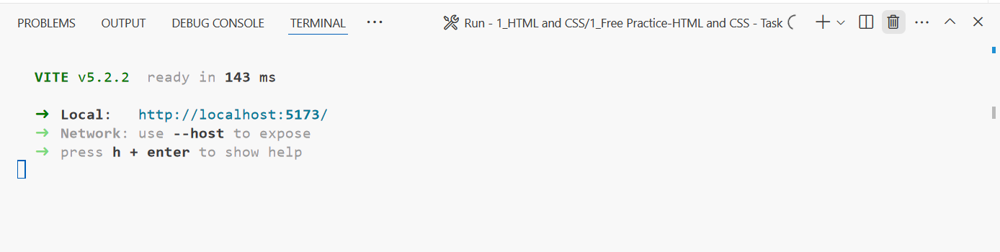

# Intro to Your Environment for 123 Students
Hello! Welcome to CSC 123! Here is a quick introduction for this assignment and the environment. 

This file is called a README. It is the first item that you should look at when you start a pre-built project or assignment. In this context, it contains an overview of your programming environment and how to get started.

On your left, there is a section of the codespace called the "Explorer". Use this to navigate the files in your assignment. Don't worry, a lot of those files you won't even have to worry
about. Just follow these instructions and you'll be set up quick and easy!

# Environment Setup

To work on this project, there are quick setups to handle. Click on the file called "package.json".
You don't have to do anything with this file, it just needs to be opened. After you open the file,
feel free to close it. (Make sure that you haven't made any changes!)

After opening and closing the file, you should see a a new menu at the bottom of your explorer labeled "NPM Scripts". 
(If that menu doesnt pop up, click the 3 dots at the top of the Explorer to open up the features menu. Scroll down and click "NPM Scripts", and the script button menu will pop up!) These are the "Quick Buttons" you will use to for setting up and running your assignments. Pretty easy, right?

# Information for Typescript

In this assignment, you are running a typescript program. While the Quick Button setup will be similar to previous assignments, there is an extra difference to note. Your previous assignments outputted to a browser page, but this one will output to the terminal. This is a section at the bottom of your Codespace. When running your program, look here to find the output, and scroll up and down to view everything that was outputted:

# .devcontainer Information
The devcontainer is limited. It is only being used to download the necessary VSCode extensions for this project, which include: 
1. Liveshare (Used for sharing access to a Codespace for group project work)

# package.json Information
Each assignment has it's own package.json file associated with it. Here are the unique scripts (Quick Buttons) associated with each package.json for this assignment.

# Quick Buttons
* Lab 2 Part 1-HTML and CSS
    * OpenLab2.1: Opens the neccesary files for this assignment. Feel free to close and open files at your leisure.
    * Run: Runs the program for this assigment. When pressed, a popup will appear on the bottom right to open up a browser window. Click "Open in browser" and see your assignment in action! If this script button is pressed again, you can terminate the browser window from the same popup in the bottom right with "Terminate Task".
    * Install: Reinstalls the necessary dependencies if there are issues with the program. If you are having trouble, click this and run your program again before trying other methods.

# Extra notes
If your program is having trouble running, close the process and reopen. This menu on the bottom right will allow you to shut down running processes. Simply open it, click the trash can symbol, wait a few seconds, and then try to run your project again by clicking "Run".

In this image, it shows the running processes menu on the right. Simply click that trash can symbol and it will end.

The menu could also look like this. The trash can in this setup is in the top right of this image:

Good luck with your assignments, and happy programming! :)